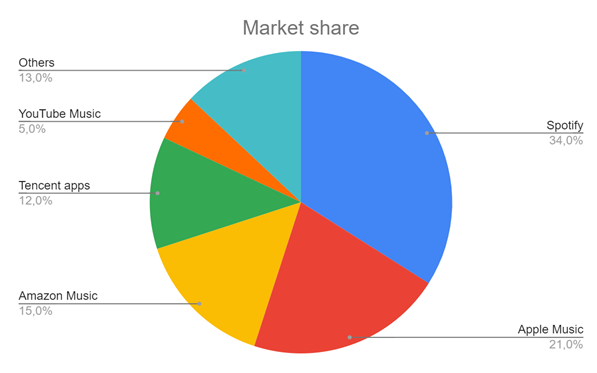

# Курсовая работа по курсу 'проектирование высоконагруженных систем' Технопарка

# Spotify

## 1. Тема и целевая аудитория

### Целевая аудитория

> Музыкальная индустрия США оценивается в $12.2 млрд и растет в среднем на 13% год. По итогам 2020 года доля стримингового аудио-потребления достигла 83%, и именно это направление обеспечивает рост всей музыкальной индустрии.

Spotify – мировой лидер на рынке стриминга музыки с долей около 34% глобального рынка и ежемесячной аудиторией в 365 млн в 178 странах. Прибыльность и актуальность данной ниши подтверждаются также следующими данными[1]:

В России Spotify официально запустился 15 июля 2020 года. 

Распределение активных пользователей по регионам[2]:

| Европа      | Северная Америка | Латинская Америка| Остальной мир |
| ----------- | -----------      |-----------       |-----------    |
| 34%         | 24%              |    22%           |      20%      |
| 124 млн     | 87,5 млн         | 80 млн           |   73 млн      |

### Ключевой функционал

Основной функционал Spotify - стриминг аудио, а также хранение информации о музыкальных произведениях (группы, текст, альбомы). У пользователей есть возможность создавать собственные плейлисты. 
Также можно выделить рекомендательную систему и подкасты, но в рамкой данный работы они не является ключевым функционалом.

## 2. Расчет нагрузки

### Продуктовые метрики

Месячная аудитория - 365 млн
Дневная аудитория - составляет 44% от месячной аудитории [4] => 160 млн
Платные подписчики - 165 млн => 45% от месячной аудитории [4]

Основые пользовательские сценарии:

    1. Авторизация;
    2. Получение информации о пользовательской медиатеке;
    3. Получение информации о плейлисте/альбоме;
    4. Добавление песен в плейлисты;
    5. Поиск групп, плейлистов, альбомов, песен;
    6. Прослушивание песни (ее стриминг и загрузка информации - обложка, текст и тд) (в среднем, 120 минут в день[4]).

### Хранение данных
Основная сущность - аудиодорожка.
Битрейт песни зависит как от подписки так и от качества соединения.
Максимальное качество для бесплатной версии 160 кбит/с, для платной - 320 кбит/с. Помимо этого есть *обычное* и *низкое* качество в 96 кбит/с и 24 кбит/с соотвественно[5].

Количество песен в Spotify - 70 млн [4].

Средняя продолжительность песни - 197 секунд[6]

Хранить необходимо каждый формат + обложки и тексты песен. Так как обложки одинаковые, как правило для нескольких песен, а текст по сравнению со звуком весит немного, то для упрощения не будем их учитывать.

Рассчитаем размер одной песни каждого битрейта:

`197 * 24 = 591 Кбайт = 0,58 Мбайт`
`197 * 96 = 2,3 Мбайт`
`197 * 160 = 3,8 Мбайт`
`197 * 320 = 7,7 Мбайт`

Рассчитаем хранилище для всей медиатеки

`70 * 10^6 * (0,58 + 2,3 + 3,8 + 7,7) = 960 ТБ`

### Сетевой трафик

Для рассчета сетевого трафика будем использовать количество дневной аудитории, разделив ее на платных и обычных подписчиков и среднее время прослушивания в день.

Дневная нагрузка:
Среднее время прослушивания в секундах на количество актинвных пользователей с разделением на битрейт

`120 * 60 * 160 * 10^6 (320 * 0,45 + 160 * 0,55)/8/1024/1024/1024 ≈ 31 113 Тб/сутки`

В секунду:

`120 * 60 * 160 * 10^6 (320 * 0,45 + 160 * 0,55)/1024/1024/1024 / 24 / 60 / 60 ≈ 2,88 Тбит/с`

---

В качестве источника пиковой нагрузки примем всех активных пользователей:

`120 * 60 * 365 * 10^6 (320 * 0,45 + 160 * 0,55)/8/1024/1024/1024 ≈ 70 978 Тб/сутки`

В секунду:

`120 * 60 * 365 * 10^6 (320 * 0,45 + 160 * 0,55)/1024/1024/1024 / 24 / 60 / 60 ≈ 6,57 Тбит/с`

### RPS

#### Авторизация

Совершается каждым активным пользователем раз в сутки. Средний рпс:

`160 * 10^6 / 24 / 60 / 60 = 1852 rps`

#### Получение информации о медиатеке

Будем считать, что в среднем человек дважды загружает свою медиатеку - когда едет на учебу/работу и когда едет с нее:

`160 * 10^6 * 2 / 24 / 60 / 60 = 3 703 rps`

#### Получение информации об конкретном плейлисте, альбоме

Примем, что прослушивается 4 различных плейлиста в день:

`160 * 10^6 * 4 / 24 / 60 / 60 = 7 407 rps`

#### Поиск

Для упрощения примем, аналогично получению информацию о плейлисте - 4 раза в день:

`160 * 10^6 * 4 / 24 / 60 / 60 = 7 407 rps`

#### Стримнг песни

Необходима загрузка медиафайла, обложки альбома и текста песни. В среднем, время пользования Spotify - 120 минут, продолжительность одной песни - 197 секунд:

`120 × 60 / 197 = 36,5 ` песен, в среднем, слушает человек в день. Округлим до 37.

`160 * 10^6 * 3  * 37 / 24 / 60 / 60 = 205 556 rps`

#### Итог

Всего rps = 225 925 rps

| Авторизация | Медиатека        | Контент альбомов/плейлистов| Поиск         |    Стриминг   |
| ----------- | -----------      |----------                  |-----------    |  -------------|
| 1852 rps    | 3 703 rps        |    7 407 rps               |   7 407 rps   | 205 556 rps   |
| 0,8%        | 1,6%             | 3,2%                       |   3,2%        |       91%     |

## Источники
    1. https://longterminvestments.ru/spotify-analysis/
    2. https://backlinko.com/spotify-users#distribution-of-spotify-monthly-active-users
    3. https://expandedramblings.com/index.php/spotify-statistics/
    4. https://www.businessofapps.com/data/spotify-statistics/
    5. https://support.spotify.com/ru-ru/article/audio-quality/
    6. https://ucladatares.medium.com/spotify-trends-analysis-129c8a31cf04