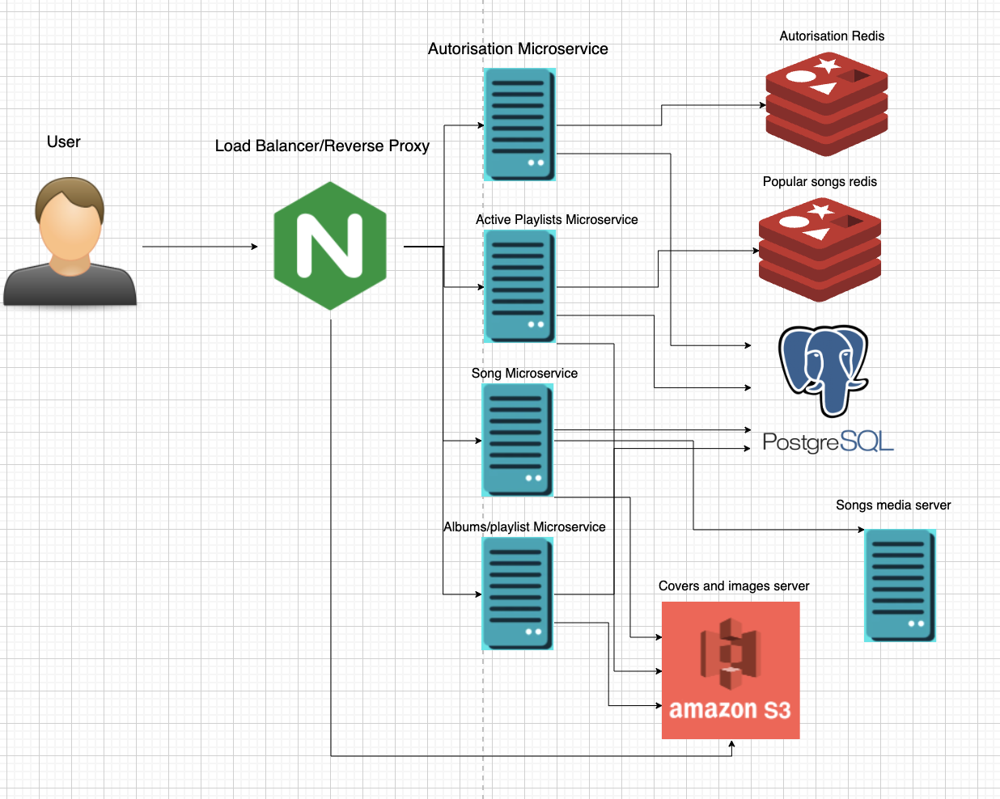

# Курсовая работа по курсу 'проектирование высоконагруженных систем' Технопарка

# Spotify

## 1. Тема и целевая аудитория

### Целевая аудитория

> Музыкальная индустрия США оценивается в $12.2 млрд и растет в среднем на 13% год. По итогам 2020 года доля стримингового аудио-потребления достигла 83%, и именно это направление обеспечивает рост всей музыкальной индустрии.

Spotify – мировой лидер на рынке стриминга музыки с долей около 34% глобального рынка и ежемесячной аудиторией в 365 млн в 178 странах. Прибыльность и актуальность данной ниши подтверждаются также следующими данными[1]:


В России Spotify официально запустился 15 июля 2020 года. 

Распределение активных пользователей по регионам[2]:

| Европа      | Северная Америка | Латинская Америка| Остальной мир |
| ----------- | -----------      |-----------       |-----------    |
| 34%         | 24%              |    22%           |      20%      |
| 124 млн     | 87,5 млн         | 80 млн           |   73 млн      |

### Ключевой функционал

Основной функционал Spotify - стриминг аудио, а также хранение информации о музыкальных произведениях (группы, текст, альбомы). У пользователей есть возможность создавать собственные плейлисты. 
Также можно выделить рекомендательную систему и подкасты, но в рамкой данный работы они не является ключевым функционалом.

## 2. Расчет нагрузки

### Продуктовые метрики

Месячная аудитория - 365 млн
Дневная аудитория - составляет 44% от месячной аудитории [4] => 160 млн
Платные подписчики - 165 млн => 45% от месячной аудитории [4]

Основые пользовательские сценарии:

    1. Авторизация;
    2. Получение информации о пользовательской медиатеке;
    3. Получение информации о плейлисте/альбоме;
    4. Добавление песен в плейлисты;
    5. Поиск групп, плейлистов, альбомов, песен;
    6. Прослушивание песни (ее стриминг и загрузка информации - обложка, текст и тд) (в среднем, 120 минут в день[4]).

### Хранение данных
Основная сущность - аудиодорожка.
Битрейт песни зависит как от подписки так и от качества соединения.
Максимальное качество для бесплатной версии 160 кбит/с, для платной - 320 кбит/с. Помимо этого есть *обычное* и *низкое* качество в 96 кбит/с и 24 кбит/с соотвественно[5].

Количество песен в Spotify - 70 млн [4].

Средняя продолжительность песни - 197 секунд[6]

Хранить необходимо каждый формат + обложки и тексты песен. Так как обложки одинаковые, как правило для нескольких песен, а текст по сравнению со звуком весит немного, то для упрощения не будем их учитывать.


Рассчитаем размер одной песни каждого битрейта:

`197 * 24 = 591 Кбайт = 0,58 Мбайт`
`197 * 96 = 2,3 Мбайт`
`197 * 160 = 3,8 Мбайт`
`197 * 320 = 7,7 Мбайт`

Рассчитаем хранилище для всей медиатеки

`70 * 10^6 * (0,58 + 2,3 + 3,8 + 7,7) = 960 ТБ`


### Сетевой трафик

Для рассчета сетевого трафика будем использовать количество дневной аудитории, разделив ее на платных и обычных подписчиков и среднее время прослушивания в день.

Дневная нагрузка:
Среднее время прослушивания в секундах на количество актинвных пользователей с разделением на битрейт

`120 * 60 * 160 * 10^6 (320 * 0,45 + 160 * 0,55)/8/1024/1024/1024 ≈ 31 113 Тб/сутки`

В секунду:

`120 * 60 * 160 * 10^6 (320 * 0,45 + 160 * 0,55)/1024/1024/1024 / 24 / 60 / 60 ≈ 2,88 Тбит/с`

---

В качестве источника пиковой нагрузки примем всех активных пользователей:

`120 * 60 * 365 * 10^6 (320 * 0,45 + 160 * 0,55)/8/1024/1024/1024 ≈ 70 978 Тб/сутки`

В секунду:

`120 * 60 * 365 * 10^6 (320 * 0,45 + 160 * 0,55)/1024/1024/1024 / 24 / 60 / 60 ≈ 6,57 Тбит/с`

### RPS

#### Авторизация

Совершается каждым активным пользователем раз в сутки. Средний рпс:

`160 * 10^6 / 24 / 60 / 60 = 1852 rps`

#### Получение информации о медиатеке

Будем считать, что в среднем человек дважды загружает свою медиатеку - когда едет на учебу/работу и когда едет с нее:

`160 * 10^6 * 2 / 24 / 60 / 60 = 3 703 rps`

#### Получение информации об конкретном плейлисте, альбоме

Примем, что прослушивается 4 различных плейлиста в день:

`160 * 10^6 * 4 / 24 / 60 / 60 = 7 407 rps`

#### Поиск

Для упрощения примем, аналогично получению информацию о плейлисте - 4 раза в день:

`160 * 10^6 * 4 / 24 / 60 / 60 = 7 407 rps`

#### Стримнг песни

Необходима загрузка медиафайла, обложки альбома и текста песни. В среднем, время пользования Spotify - 120 минут, продолжительность одной песни - 197 секунд:

`120 × 60 / 197 = 36,5 ` песен, в среднем, слушает человек в день. Округлим до 37.

`160 * 10^6 * 3  * 37 / 24 / 60 / 60 = 205 556 rps`

#### Итог

Всего rps = 225 925 rps


| Авторизация | Медиатека        | Контент альбомов/плейлистов| Поиск         |    Стриминг   |
| ----------- | -----------      |----------                  |-----------    |  -------------|
| 1852 rps    | 3 703 rps        |    7 407 rps               |   7 407 rps   | 205 556 rps   |
| 0,8%        | 1,6%             | 3,2%                       |   3,2%        |       91%     |


## 3. Логическая схема


## 4. Физическая схема


В физической схеме указаны отношения между таблицами (M2M - связь многие ко многим 'many to many', O2M - связь один ко многим 'one to many'). Также произведения деномизация для избежания избыточных джойнов - в таблицу **albums** добавлено поле с именем исполнителя **artist_nickname**, а в таблицу с информацией о песне - 3 новых поля **artist_name**, **album_id**, **album_title**.

### Решения используемые для хранения данных

Типы данных можно условно разделить на 3 типа:
1. Тесктовые данные, такие как информация о пользователях, исполнителях, альбомах и композициях.
2. Медиафайлы, такие как аудиофайлы и изображения.
3. Пользовательские сессии.
   
Начнем с сессий:
Для них будет использоваться key-value база данных. Cамые популярные решения на рынке это **Tarantool** и **Redis** остановимся на втором за его простоту и открытый исходный код. Также будем использовать для хранения активных, в данный момент, плейлистов.

Медиафайлы:
Используем S3 хранилище - **Amazon S3**.

Текстовая информация:
Для хранение текстовой информации, которая имеет сложную структуру и связь отлично подойдет реляционная база данных - **SQL**. Одно из самых популярных решений в данный момент является **PostgreSQL** за счет наибольшей функциональности среди конкурентов, принципам ACID, а также паралеллизм (MVCC), а также большое комьюнити разработчиков и юзеров. [7]

### Вычисление объемов хранилищ

В пункте 2 был проведен расчет хранилища для аудиофайлов:

```
Рассчитаем хранилище для всей медиатеки
`70 * 10^6 * (0,58 + 2,3 + 3,8 + 7,7) = 960 ТБ`
```
Теперь проведем расчет для прочих данных.

1. Картинки. Размер изображения для обложки веб-версии - 25 кб . Обобщим, что для каждой песни используется своя картинка (на самом деле это не так, ведь песни в одном альбоме будут иметь одинаковые изображение, но таким образом компенсируем различные плейлисты): `70 * 10^6 * 25кб = 1750000000 кб = 1,62981450558 тб `

2. Сессии. Рассчитываем для DAU - на хранение сессий потребуется `( 4(id) + 4(user_id) + 32(SHA256)) * 160 * 10^6 = 6 Гб`
Для активных плейлистов для каждого пользователя будем хранить текущий альбом и текущую песню: 
`4(id) + 4(track_id) + 256(track_name) + 256(artist_name) + 256(album_name) + 4(user_id) + 4(album_id) = 784б` 
`784 * 160 * 10^6 = 117 Гб` (Стоит не забывать, что речь тут будет про оперативную память)

3. PostgreSQL
Считаем не только для DAU, а вообще для всех пользователей

Пользователь:
`4(id) + 256(name) + 256(email) + 256(hash) + 1(premium) + 4(active_playlist) = 777 байт`.
Примерно 365 млн.
Связь many to many для плейлистов: `4 * 3 = 12 байт`.

Трек:
`4(id) + 256(title) + 1024(lyrics) + 4 * 256(path) + 256(logo_path) + 256(artist_name) + 256(album_title) + 4(album_id4)= 3 080 байт`
Примерно 70 млн.

Связь many to many для плейлистов: `4 * 3 = 12 байт`.

Альбом:
`4(id) + 256(title) + 256(artist_name) + 256(logo_path) + 4(artist_id) = 776 байт`
Примерно [8] 70 млн / 13 = 5,8 млн.

Плейлист:
`4(id) + 4(user_id) + 4(song_id) + 256(logo_path)= 268 байт`
Пусть число плейлистов будет равно числу треков - 70 млн.

Исполнитель:
`4(id) + 256(nickname) + 256(logo_path) + 4(album_id) = 520 байт`
Пусть у каждого исполнителя в среднем 5 альбомов. Примерно: 1,16 млн.

Итог:
`365 * 10^6 * (777 + 12) пользователи + 70 * 10^6 * (3080 + 12) треки + 5.8 * 10^6 * 776 альбомы + 70 * 10^6 * 268 плейлисты + 1.16 * 10^6 * 520 = 10^6 * (287 985 + 216 440 + 4 500.8 + 18 760 + 603.2) байт =  492 гб `

Будем использовать репликацию. Для этого сделаем две Slave копии и одну основную Master копию. Большинство логики завязано на треках, поэтому для шардирования можно использовать song_id. Стоит учесть тот факт, что нагрузка на сервера с популярными песнями будет больше. Можно разрешить этот момент использовав дополнительный сервер с memcached, в который будут попадать популярные песни. В случае его неполадки запросы можно будет вернуть на более медленный бэкенд.
Допустим, что популярных песен 10% от общего числа. 

Тогда объем памяти для хранении информации о популярных песня - `7 * 10^6 * (3080 + 12) = 20 гб`. (Стоит не забывать, что речь тут будет про оперативную память)


## 5. Технологии

### Бэкенд
Golang - используем по нескольким причинам: 1) простота и поддерживаемость; 2) по первой причине на Go намного проще (по сравнению с C++) организовать многопоточную обработку данных; 3) язык ориентирован на микросервисную архитектуру, для которой можно будет использовать gRPC (о ней позже). 

gRPC по умолчанию использует HTTP/2 — новейший сетевой транспортный протокол, что делает gRPC намного более быстрым и надежным по сравнению с REST на HTTP/1.1. Использование gRPC вместо REST обладает следующими плюсами: 
* Скорость работы. Здесь используется бинарная сериализация Protocol Buffers ― protobuf. По некоторым подсчетам, она в семь раз быстрее, чем сериализация в JSON.
* Обратная совместимость. Благодаря особенностям сериализации, gRPC удобно изменять по мере развития API.
* Спецификация. Разработка начинается строго с контракта: необходимо сначала описать proto-файлы и затем преобразовать контракт в заглушки для реализации клиента.

### Фронтенд
Выбор тут более ограничен - HTML, CSS, + React/Typescript. React является наиболее популярным фреймворком, который использует компонентный подход (проще найти специалистов), а Typescript избавляет о некоторых проблем Javascript добавляя строгую типизацию. Также среди плюсов React можно выделить инкапсулированность данных внутри js, поэтому не нужно использовать сторонние шаблонизаторы, это повысит производительность.[9]

### Мобильные приложения
Так как **Frontend** содержит React, то и для мобильных приложений можно использовать **React Native**. Это позволит сэкономить, так как не придется искать отдельных специалистов под каждую из мобильных платформ.

### Хранилища данных
**PostgreSQL**, **S3 хранилище**, **Redis**. Были более подробно упомянуты в пункте 4. 

### Балансировка нагрузки
Используем **Nginx** для балансировки нагрузки и в качестве reverse-proxy.


### Микросервисная архитектура
Для повышения отказоустойчивости и возможности горизонтального масштабирования используем микросервисную архитектуру.
Так как Redis используется для авторизации, то в качестве первого микросервиса можно выделить микросервис **авторизации**.

В качестве второго микросервиса можно выделить также сервис, который использует Redis, микросервис **активных плейлистов/альбомов**

Для третьего можно выделить микросервис **треков**.

И наконец, микросервис **альбомов и плейлистов**.

## 6. Итоговая схема



## 7. Список серверов

С учетом информации о распределении пользователей и географической карты дата-центров [11] для размещения серверов выберем следующие города:
  * Москва (Россия)
  * Франкфурт (Германия)
  * Лондон (Великобритания)
  * Стокгольм (Швеция)
  * Токио (Япония)
  * Дели (Индия)
  * Бразилиа (Бразилия)
  * Мехико (Мексика)
  * Сидней (Австралия)
  * Нью-Йорк (США)
  * Сан-Франциско (США)

По ним распределяется нагрузка в ~6.5 ТБит/с и городе каждом должно храниться около 960 ТБ медиафайлов (из расчета во втором пункте 2). В один сервер можно установить 24 диска [12], ssd диски можно найти объемом 4 или 8 тб, но 8тб диски очень дорогие в соотношение цена/объем по сравнению с 4тб дисками, поэтому выберем 4тб. С учетом того, что должен быть запас по памяти нам понадобится около 13 серверов. Также для обеспечения устойчивости следуют использовать RAID 10 подключение для дисков, для которого характерно использование половины памяти диска, что удвоит число серверов в виду уменьшения памяти на каждом из них. Также для обеспечения отказоустойчивости понадобиться второй похожий набор серверов, который разместим в другом дата-центре этих или ближайших к ним городов.

| Город         |Количество серверов для аудифайлов | 
| ------------- |:------------------:|
| Москва (Россия)| 26                | 
| Франкфурт (Германия)| 26                | 
| Лондон (Великобритания)| 26                | 
| Стокгольм (Швеция)| 26                | 
| Токио (Япония)| 26                | 
| Дели (Индия)| 26                | 
| Бразилиа (Бразилия)| 26                | 
| Мехико (Мексика))| 26                | 
| Сидней (Австралия)| 26                | 
| Нью-Йорк (США)| 26                | 
| Сан-Франциско (США)| 26                | 

Каждому из кластеров понадобится балансировщик нагрузки с дополнительной репликой для отказоустойчивости.

Для хранения изображений нужен объем примерно в 1.5 тб, поэтому однако диска на 4тб хватит для обеспечения RAID 10, но также используем реплику для обеспечения отказоусточивости. Также нужны дополнительные балансировщики нагрузки, аналогично с аудиофайлами.

Для сервиса авторизации и хранения популярных используем Redis, который хранит данные в оперативной памяти, поэтому поставим в них диски на 128 гб и 256гб оперативной памяти, так же понадобится реплика в каждый кластер.

Тестовой информации у нас тоже немного ~500гб, но для повышения производительности можно поставить такой же объем оперативной памяти, для более эффективного кеширования. Одного диска на 4тб хватит для RAID 10. Для сохранности данных используем 1 мастера для записи и 2 слейвов для чтения (итого 3 сервера в каждый город).

Остаются микросервисы и reverse-proxy к ним. Для reverse-proxy воспользуемся аналогичной схемой как и балансировщиками - 2 сервера с nginx. Каждый сервер должен обладать большим объемом оперативной памяти, но малым объем физической памяти - дисков на 64гб должно хватить. Выходит 4 сервера и по реплике к каждому из них в каждый город.

Все рассуждения можно оформить в виде следующей таблицы:

| Технология    | RAM                | Диск(и)  | Количество серверов      |
| ------------- |:------------------:| -----:   |     -----:               |
| Аудиофайлы    | 128гб              | 4Тб * 24 | 52 * 11(каждый город) |    
| Изображения   | 128гб              |   4Тб    |   2 * 11(каждый город)   |
| PostgreSql    | 512гб              |   4ТБ    |   3 * 11(каждый город)  |
| Redis         | 256гб              |   128гб  | (2+2) * 11(каждый город) |
| Backend       | 256гб              |    128гб  | (1+1+1+1)*2 *11(каждый город)  |
| Nginx         | 256гб              |    128гб   | (1+1+1)*2 *11(каждый город)    |


## Источники
    1. https://longterminvestments.ru/spotify-analysis/
    2. https://backlinko.com/spotify-users#distribution-of-spotify-monthly-active-users
    3. https://expandedramblings.com/index.php/spotify-statistics/
    4. https://www.businessofapps.com/data/spotify-statistics/
    5. https://support.spotify.com/ru-ru/article/audio-quality/
    6. https://ucladatares.medium.com/spotify-trends-analysis-129c8a31cf04
    7. https://mcs.mail.ru/blog/postgresql-ili-mysql-kakaya-iz-etih-relyacionnyh-subd
    8. https://ru.wikipedia.org/wiki/%D0%9C%D1%83%D0%B7%D1%8B%D0%BA%D0%B0%D0%BB%D1%8C%D0%BD%D1%8B%D0%B9_%D0%B0%D0%BB%D1%8C%D0%B1%D0%BE%D0%BC
    9. https://reactjs.org/
    10. https://habr.com/ru/company/m2tech/blog/652305/
    11. https://map.datacente.rs/
    12. https://cloud.mail.ru/public/KG9v/yqWLthuo6
